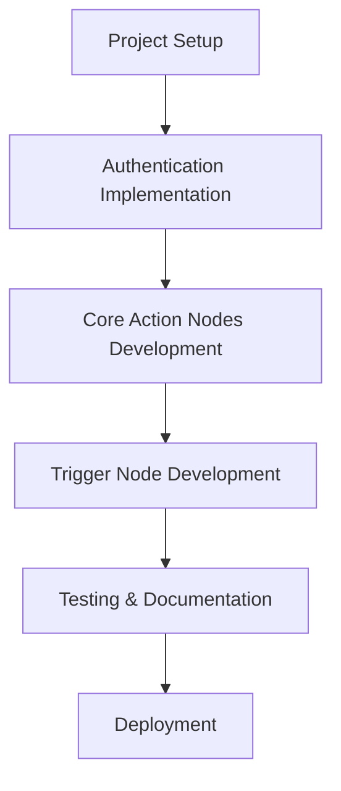
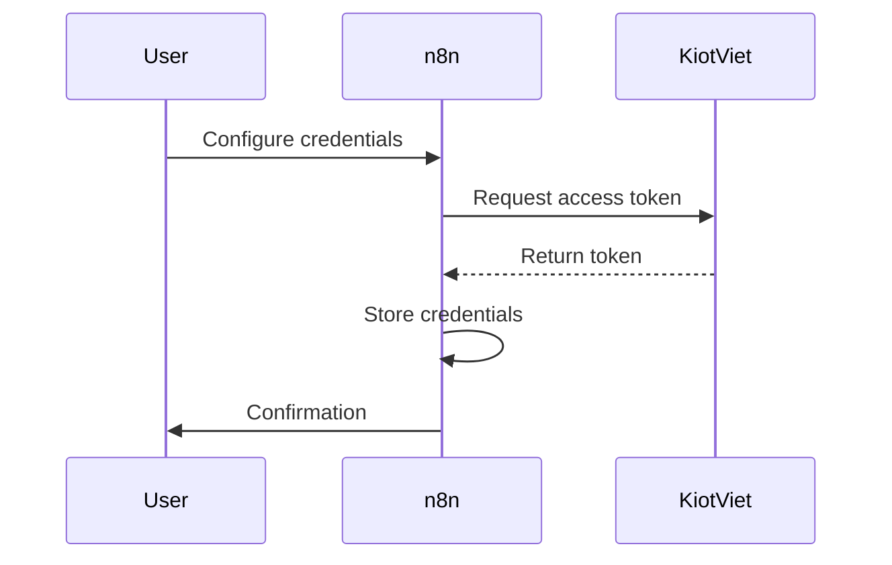

# KiotViet n8n Integration Implementation Plan

## Overview

This document outlines the implementation plan for creating custom n8n nodes to integrate with the KiotViet retail management system using their official SDK.

## 1. Project Setup (Priority: High)
- Initialize n8n custom nodes project structure
- Set up TypeScript configuration
- Install required dependencies (including kiotviet-client-sdk)
- Configure development environment

## 2. Authentication Implementation (Priority: High)
- Create KiotViet credentials type
- Implement OAuth2 authentication handling
- Store and manage client credentials:
  - clientId
  - clientSecret
  - retailerName
- Handle token management and refresh logic

## 3. Core Action Nodes Development (Priority: High)

### First Phase (Essential Operations)

#### 3.1 KiotViet Products Node
- Functionality:
  - List products with filtering and pagination
  - Create new products
  - Update existing products
  - Search products
  - Manage inventory levels
- Features:
  - Batch operations support
  - Category filtering
  - Inventory tracking
  - Price management

#### 3.2 KiotViet Orders Node
- Functionality:
  - Create new orders
  - Update order status
  - List and search orders
  - Handle order cancellations
- Features:
  - Multiple product line items
  - Discount handling
  - Customer association
  - Payment tracking

#### 3.3 KiotViet Customers Node
- Functionality:
  - Create new customers
  - Update customer information
  - Search customers
  - Manage customer groups
  - List customers with filtering
- Features:
  - Contact information management
  - Group assignment
  - Search by various criteria
  - Customer history tracking

### Second Phase (Additional Operations)

#### 3.4 KiotViet Invoices Node
- Functionality:
  - Create invoices
  - List and search invoices
  - Handle payment methods
  - Manage invoice status
- Features:
  - Multiple payment method support
  - Tax calculation
  - Discount application
  - Status tracking

#### 3.5 KiotViet Categories Node
- Functionality:
  - Create and update categories
  - List and search categories
  - Manage category hierarchy
- Features:
  - Parent-child relationships
  - Category attributes
  - Product associations

## 4. Trigger Node Development (Priority: Medium)

### KiotViet Webhook Trigger Node
- Implementation:
  - Webhook registration system
  - Event handling for:
    - Order status changes
    - Product inventory updates
    - Customer updates
    - Invoice status changes
- Features:
  - Real-time event processing
  - Event filtering options
  - Error handling
  - Retry mechanisms

## 5. Testing & Documentation (Priority: High)

### 5.1 Testing
- Unit tests for all nodes
- Integration tests
- Error handling scenarios
- Rate limit testing
- Webhook reliability testing

### 5.2 Documentation
- Setup guide
- Authentication configuration
- Usage examples:
  - Basic operations
  - Complex workflows
  - Best practices
- Webhook configuration guide
- Troubleshooting guide

## 6. Deployment (Priority: Medium)
- Package preparation
- Distribution setup
- Installation documentation
- Optional community submission

## Technical Considerations

### Authentication Flow

### Error Handling Strategy
- Implement retry logic for API failures
- Handle rate limiting scenarios
- Provide clear error messages
- Log important errors for debugging

### Performance Optimization
- Implement efficient pagination
- Optimize API calls
- Cache frequently used data
- Minimize unnecessary requests

### Security Considerations
- Secure credential storage
- Token encryption
- Safe webhook handling
- Data validation

## Implementation Timeline

1. Project Setup & Authentication: 1 week
2. Core Action Nodes (First Phase): 2 weeks
3. Trigger Node Development: 1 week
4. Additional Nodes (Second Phase): 2 weeks
5. Testing & Documentation: 1 week
6. Deployment & Refinement: 1 week

Total Estimated Time: 8 weeks
